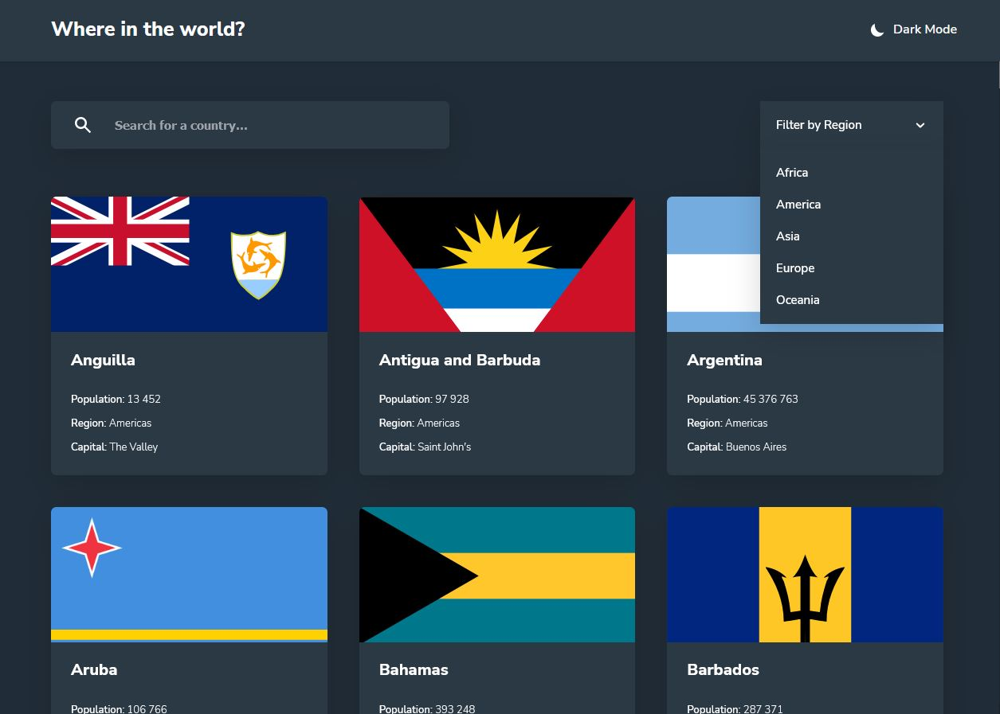
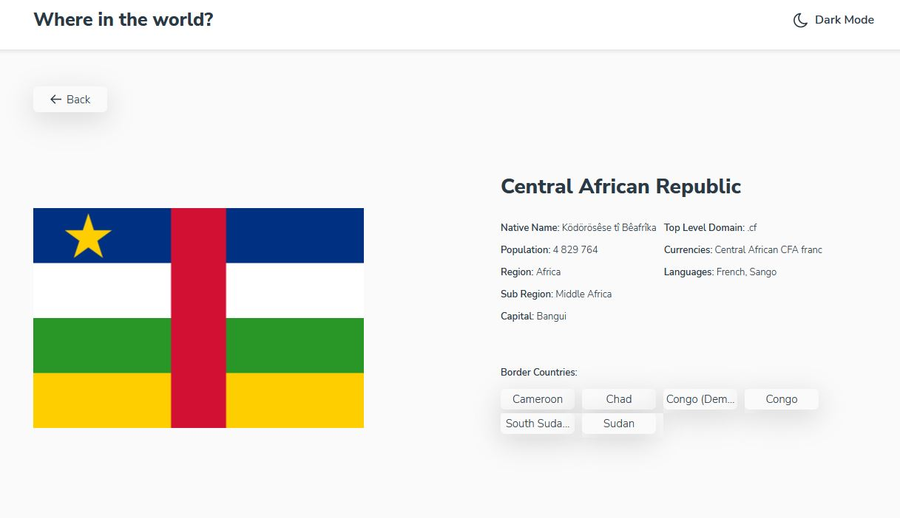

# REST Countries API

REST Countries API is a web app that allows users to see a list of all countries and territories of the world, check detailed information about each of them, filter the list by region and search for a specific country. This is a solution to the [REST Countries API challenge on Frontend Mentor](https://www.frontendmentor.io/challenges/rest-countries-api-with-color-theme-switcher-5cacc469fec04111f7b848ca).

**Link to project:** https://rest-countries-phuopgw0z-pskrzypek97.vercel.app/





## How To Run It Locally

1. Clone the repo

```sh
git clone https://github.com/pskrzypek97/Audiophile.git
```

2. Install NPM packages

```sh
npm install
```

3. Run the development server:

```sh
npm start
```

4. Open [http://localhost:3000](http://localhost:3000) with your browser to see the result.

## Tech Used

- ReactJS
- [React Router](https://reactrouter.com/) - JS Library
- SASS
- [Framer Motion](https://www.framer.com/motion/) - JS Library

## How It's Made

I started the project by planning it first. I decided to create two pages, the Home and the CountryPage. The Home page shows the list of all countries and territories of the world and allows the user to filter it and to search for a specific place. After the user clicks on one of the countries, the CountryPage is rendered. This page shows basic information about a particular place, e.g. region, population, currency and more. There is also a list of neighbouring states, where users can pick what country's information they want to read about. The app's data is fetched from [Rest Countries](https://restcountries.com/) inside useFetchCountries custom hook.

To manage a theme and an array of countries, I used Context API. In the store folder there are 2 files responsible for the global state: ThemeProvider and CountryProvider. The ThemeProvider manages the styles of numerous components based on whether the user prefers dark or light mode. The CountryProvider takes care of managing the countryArray and filtering operations.

Routing is managed with [React Router](https://reactrouter.com/) library. Whenever a user visits a particular CountryPage, the page's slug is an alpha-3 code. I decided to use this instead of country names because it is a standardized naming convention and many states either have very long names or use foreign letters. Also, when a user filters the country list, React Router generates a query string "region" with a chosen region of the world. I introduced this so the user can use navigation buttons when they want to come back to the main list.

Hooks folder contains 3 files: useCountryDetails, useFetchCountries and useFilter. All of them contain logic from components which otherwise would be too long and convoluted. These components are Home, CountryPage and App.

I use [Framer Motion](https://www.framer.com/motion/) library to manage animations of the app, mainly transitions between Home and CountryPage and hovering of CountryCard component.

## Lessons Learned

REST Countries API was my first contact with React and I enjoyed it a lot. It is a much better tool to create websites compared to vanilla JS, which I used in previous projects. React greatly improves readability of the code and it is much easier for me to move around the project. The challenge for me was to understand the concept of hooks, but with trial and error I was able to use them in an appropriate way. Overall, I will definitely stick with React for longer.

## Future improvements

- <strike>Rebuilt the project using React Router library, which will allow users to navigate around the page using navigation buttons and also to search for specific country by typing in the address bar</strike> Added routing, now each CountryDetail page has its own slug (which is alpha-3 code) and "region" query appears when filtering the list of countries.
- <strike>improve optimization by implementing useMemo and useCallback hooks and lazy loading</strike> Used both hooks in a number of components and in the ThemeProvider and the CountryProvider. They improved optimisation minimally.
